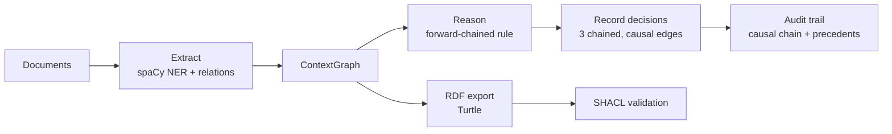

# Accountable Lending

An auditable small-business loan-decision pipeline built on
[Semantica](https://github.com/semantica-agi/semantica) — graph-native
infrastructure for context and accountable AI systems.

The demo walks a loan application for **Sunrise Coffee Roasters LLC** through
a governed AI decision and ends with the question every regulator asks:
**"why was this loan routed to manual review?"** — answered by the graph
itself, not by a prompt.

> **No LLM anywhere in this pipeline.** Extraction is local spaCy, reasoning
> is forward-chained rules, and every decision is a node in a context graph
> with provenance. That determinism is the point.

---

## The pipeline



| Stage | What happens | Semantica module |
|---|---|---|
| 1. Ingest | Three applicant documents (business profile, financials, risk notes) are read through `FileIngestor` | `ingest` |
| 2. Extract | 40+ entities and 150+ relationships pulled from the documents by local spaCy-backed extractors | `kg.GraphBuilder` |
| 3. Graph | A `ContextGraph` assembled from the extractions — entities, relationships, weights | `context` |
| 4. Reason | `HighRiskFlag(X) AND ThinCreditHistory(X) => RequiresManualReview(X)` forward-chains and derives a new fact | `reasoning` |
| 5. Decide | Three decisions recorded with full context and explicit `CAUSED` edges: risk classification → policy check → final outcome | `context` |
| 6. Audit | The causal chain is traversed back from the final decision; precedents are searched | `context` |
| 7. Export | The graph is exported as RDF/Turtle and validated against SHACL shapes — *"Graph conforms to all SHACL constraints"* | `export`, `ontology` |

## Quick start

```bash
python -m venv .venv && source .venv/bin/activate
pip install -r requirements.txt
python -m spacy download en_core_web_sm

python demo.py
```

Expected runtime: under a minute (the first run downloads the spaCy model).

## What the output looks like

```
========================================================================
  Reason
========================================================================
    derived: RequiresManualReview(SunriseCoffeeRoasters)  (via Rule 1)

========================================================================
  Audit
========================================================================
    causal chain (upstream from the final decision):
      <- [risk_classification] high_risk  (c866337f-…)
      <- [policy_check] manual_review_required  (ce1cd65a-…)

========================================================================
  Export & validate
========================================================================
    exported RDF: exports/lending_graph.ttl
      triples written: 157
    SHACL validation: Graph conforms to all SHACL constraints.
```

## Why this matters

An AI agent that approves or rejects a loan has to survive a regulator's
"why?" months later. A vector database stores embeddings; it cannot show the
chain `risk notes → rule → decision → policy check → outcome`. This demo is
that chain, persisted as a graph:

- the **documents** that were ingested,
- the **entities** extracted from them,
- the **rule** that fired and the fact it derived,
- the **decisions** and the causal edges between them,
- the **export** that any triplestore can read, validated against shapes.

Re-run `demo.py` on modified data and the pipeline produces a *different*
trail — same mechanics, new evidence. That is the difference between
"the model said so" and "here is the audit trail".

## Testing

```bash
# Fast unit tests (default)
python -m pytest tests/ -q

# Integration smoke test — runs the real ingest→extract→reason→decide
# stages against the bundled data (needs the spaCy model)
python -m pytest tests/ -q -m integration
```

## Repository layout

```
demo.py            the pipeline, one stage per function
data/              the three applicant documents (plain text)
tests/             unit tests + integration smoke test
exports/           generated RDF (git-ignored)
```

## License

MIT — see [LICENSE](LICENSE). Built on [Semantica](https://github.com/semantica-agi/semantica) (MIT).
