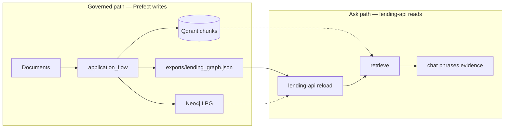
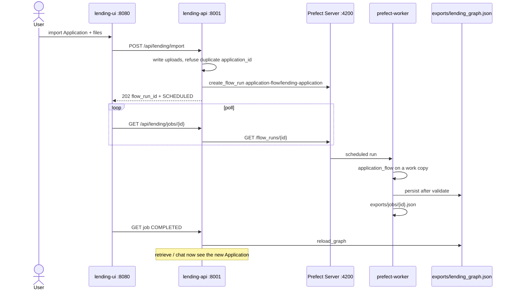
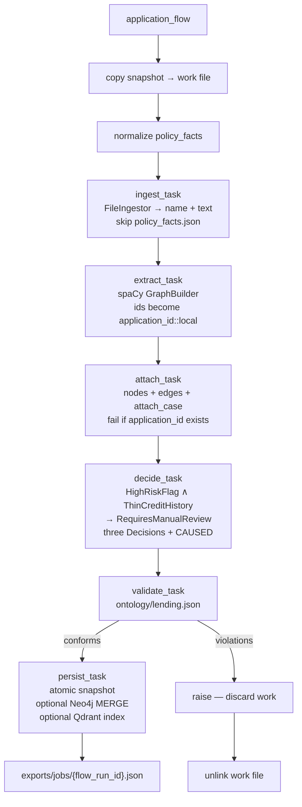
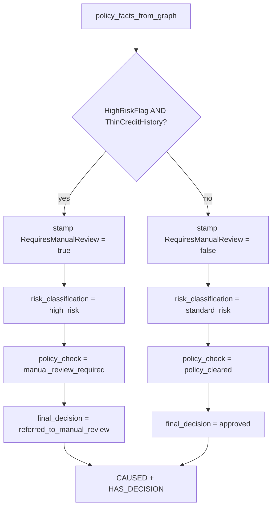
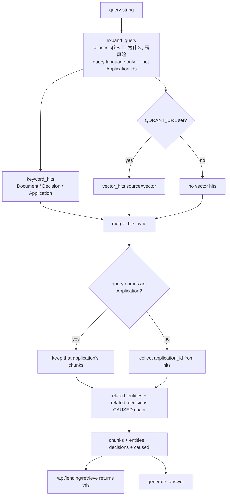
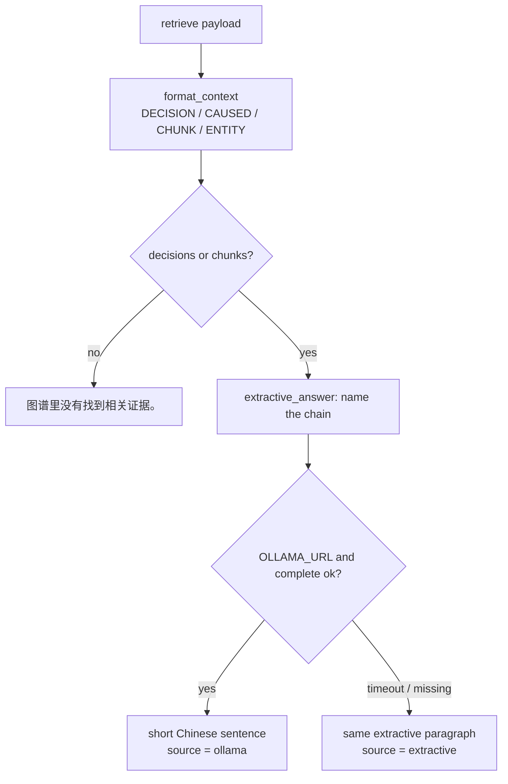
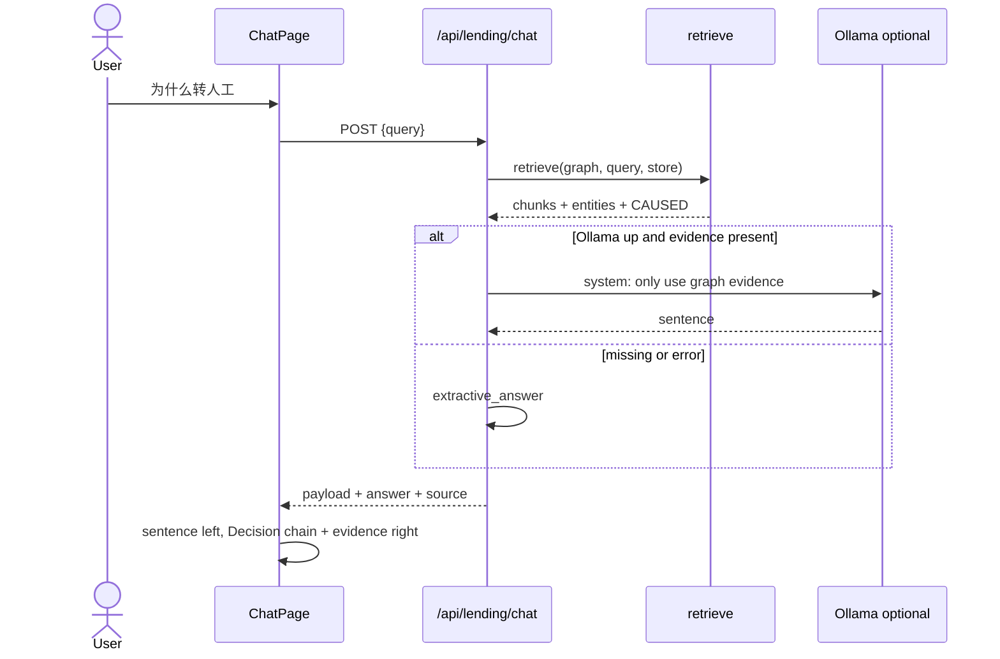
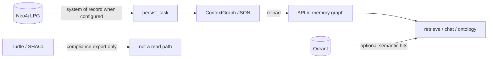

# Runtime flows: write the graph, then ask it

Decisions live in [ADR-0002](adr/0002-no-generation-on-governed-path.md)
and [ADR-0009](adr/0009-prefect-orchestrates-application.md). Domain words
live in [CONTEXT.md](../CONTEXT.md). This page is the walkthrough.

Two paths share one **ContextGraph**. They never share an in-memory object
across processes.

| Path | May use an LLM? | System of record |
|---|---|---|
| Prefect `application_flow` | No | ContextGraph snapshot + LPG |
| `retrieve` | No | Same graph; Qdrant is optional recall |
| `chat` | Yes, only to phrase retrieve evidence | Still the graph. Chat is not the Audit trail |

---

## 1. Who talks to whom

lending-api never imports `lending_prefect`. The worker never mutates the
API process. The handoff is the snapshot file (and, after Complete, a
job JSON).

Seed on first boot is the same flow: `backend/snapshot.py` calls
`submit_seed_run` (Sunrise documents under `data/`) when the snapshot is
missing or `LENDING_REBUILD` is set.

`PREFECT_API_URL` unset (unit tests): `lending_prefect.flows` runs
`application_flow` in-process and keeps a local job map. Compose does not
use that path.

---

## 2. Prefect: assemble one Application

`application_flow` is the only assembler. Tasks call leaves. `record_decision`,
scoped ids, and `CAUSED` take no Prefect types.

Work happens on a copy `{snapshot}.{application_id}.work`. Success replaces
`exports/lending_graph.json`. Failure deletes the work file. Deployment
concurrency is 1.

### Decide branch (deterministic)

Facts are already on the Application (`policy_facts.json` or the import
form). They are not invented at retrieve time.

Code: `prefect/lending_prefect/flows.py` (compose), `ingest.py`,
`attach.py`, `decide.py`, `snapshot.py`. Inner attach / facts:
`backend/application/`. HTTP submit / poll: `backend/prefect_api.py`.

---

## 3. Query: retrieve first, chat only phrases

`POST /api/lending/retrieve` and `POST /api/lending/chat` share
`retrieve()`. Chat adds a sentence. Neither writes the graph.

Chat generation:

UI chat (`ChatPage`) POSTs **only the current sentence**. No server-side
history. The right-hand panel is the latest evidence, not the chat log.

Code: `backend/retrieve/` (search + expansion + audit walk),
`backend/chat.py`, `backend/routes.py`.

---

## 4. What each store is for

A vector hit can surface a risk-note chunk. It cannot be the answer to
“why manual review?”. That answer is the **Audit trail**: Documents,
Entities, the derived `RequiresManualReview` fact, and the **CAUSED**
Decision chain.
